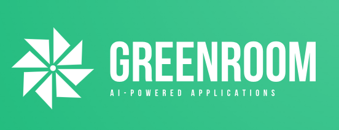

<div align="center">

  
  <h1>Greenroom: Your Backend Factory for AI-Powered Applications</h1>
  
  <p>
    A boilerplate project designed to accelerate the development of AI-powered applications and robust data pipelines.
  </p>
  
<!-- Badges -->
<p>
  <a href="https://github.com/PuneetShrivas/Greenroom/graphs/contributors">
    
  </a>
  <a href="">
    
  </a>
  <a href="https://github.com/PuneetShrivas/Greenroom/network/members">
    
  </a>
  <a href="https://github.com/PuneetShrivas/Greenroom/stargazers">
    
  </a>
  <a href="https://github.com/PuneetShrivas/Greenroom/issues/">
    
  </a>
  <a href="https://github.com/PuneetShrivas/Greenroom/blob/master/LICENSE">
    
  </a>
</p>
   
<h4>
    <a href="https://github.com/PuneetShrivas/Greenroom/">View Demo</a>
  <span> · </span>
    <a href="https://github.com/PuneetShrivas/Greenroom">Documentation</a>
  <span> · </span>
    <a href="https://github.com/PuneetShrivas/Greenroom/issues/">Report Bug</a>
  <span> · </span>
    <a href="https://github.com/PuneetShrivas/Greenroom/issues/">Request Feature</a>
  </h4>
</div>

<br />

<!-- Table of Contents -->
# :notebook_with_decorative_cover: Table of Contents

- [About the Project](#star2-about-the-project)
  * [Tech Stack](#space_invader-tech-stack)
  * [Key Features](#dart-key-features)
- [Getting Started](#toolbox-getting-started)
  * [Prerequisites](#bangbang-prerequisites)
  * [Installation](#gear-installation)
  * [Configuration](#wrench-configuration)
  * [Running the Project](#running-running-the-project)
- [Project Structure](#file_folder-project-structure)
- [Deployment](#triangular_flag_on_post-deployment)
- [Contributing](#wave-contributing)
- [License](#warning-license)

<!-- About the Project -->
## :star2: About the Project

Greenroom is a boilerplate project designed to accelerate the development of AI-powered applications and robust data pipelines. It seamlessly integrates a powerful tech stack to empower you with:

### :space_invader: Tech Stack
- **Python**: The foundation for our backend services.
- **FastAPI**: A high-performance framework for building APIs.
- **LangChain**: Simplifies working with language models and data sources.
- **Docker**: Containerization for seamless deployment.
- **ChromaDB, Elasticsearch, Firestore**: Choose the database that best suits your needs.
- **Selenium**: Web scraping capabilities.
- **Google Sheets API**: Integrate with spreadsheets for data input/output.
- **(Optional) Celery**: Task queue for background processes and scheduling.

### :dart: Key Features
- **Rapid API Development**: Effortlessly build RESTful endpoints for Retrieval-Augmented Generation (RAG), custom backend processes, and database interactions.
- **Data Ingestion**: Streamline data collection via web scraping with Selenium and Google Sheets integrations.
- **Data Management**: Powerful filtering and search with Elasticsearch, automated database maintenance (cron jobs).
- **Deployment & Observability**: Docker-based deployment for consistency, robust logging and testing architecture.
- **Modular Structure**: Clearly organized modules for API endpoints, data pipelines, and database operations.
- **Example Implementations**: Get started quickly with code examples for RAG, web scraping, data filtering, etc.
- **Configuration**: Easily adjust settings for databases, logging, and scraping targets.
- **Testing Framework**: Included tests ensure the reliability of your application.
- **Scalability**: Designed to grow with your needs.

## :toolbox: Getting Started

### :bangbang: Prerequisites
This project requires Docker and Python installed on your local machine.

### :gear: Installation
1. Clone the repo:
   ```bash
   git clone https://github.com/your-username/greenroom.git
2. Navigate to the project directory:
    ```bash
    cd greenroom
3. Install the required Python packages:
    ```bash
    pip install -r requirements.txt

### :wrench: Configuration
Update the configuration files in config/ according to your setup.

### :running: Running the Project
1. For Development:
    ```bash
    docker-compose up
2. For Production:
    ```bash
    See deployment instructions below.

## :file_folder: Project Structure
```bash
greenroom/
├── app/               
│   ├── api/            # FastAPI endpoints (RAG, custom)
│   ├── pipelines/      # Data ingestion pipelines
│   ├── services/       # Core business logic (database interactions, search)
│   └── utils/          # Helper functions
├── config/            # Configuration files
├── data/               # Sample data or data storage
├── docker-compose.yml  # For development environment
├── Dockerfile          # For production builds
├── tests/              # Test suite
├── README.md           # You are here!
└── requirements.txt    # Project dependencies
 ```
## :triangular_flag_on_post: Deployment
Greenroom is optimized for Docker-based deployment. You can use a cloud platform (AWS, GCP, Azure) or your own infrastructure. Detailed instructions can be found in docs/deployment.md.

## :wave: Contributing
Contributions are always welcome!

See CONTRIBUTING.md for ways to get started.

<!-- License -->
:warning: License
This project is licensed under the [Choose License] License.